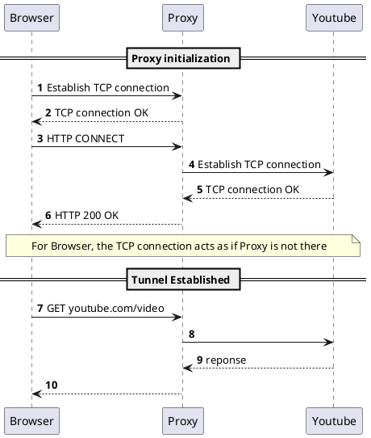
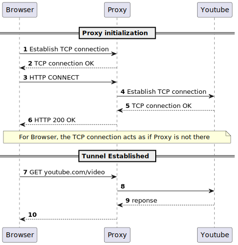

# HTTP headers 

Hypertext Transfer Protocol (HTTP) Field Name Registry
https://www.iana.org/assignments/http-fields/http-fields.xhtml

## Access-Control-*

- Access-Control-Allow-Origin
- Access-Control-Allow-Credentials
- Access-Control-Allow-Headers
- Access-Control-Expose-Headers
- Access-Control-Max-Age
- Access-Control-Request-Headers
- Access-Control-Request-Method
- Access-Control-Allow-Origin
- Access-Control

### Problem description

Cookies are shared even between windows: https://stackoverflow.com/questions/49687204/same-browser-but-different-windows-do-they-share-cookies
This can lead to risky scenario such as
1. User in tab 1 is logged in Youtube.
1. Youtube adds in the response a `Set-Cookie` header with token like value
1. As a consequence webrowser stores the cookies in the cookie jar  
1. User in tab 2 is visiting mywebsite.dev which is `malicious` 
1. Browser of user, is executing javascript in tab 2 from `mywebsite.dev` targeting `youtube.com`
1. Since the Browser see that the desitination is youtube.com for which we have a cookie, it automatically adds the cookies to request
1. Therefore `mywebsite.dev` can perform action on behalf of the user in `youtube.com` 

Note this issue is coming from the fact we execute java script which can perform write operation, when we were using only HTML it was not issue since only READ operation was allowed.
However data could be read and malicpous user could collect this data (send to db in his domain) and make a write operation in a second time. 

### SOP (Same Origin Policy) 

To avoid this scenario, Web browser introduced SOP by default.

Where origin is a 3-uplet (domain, protocol, port)

Eg: Safari on `mywebsite.dev` cannot request something on YouTube.com

In [problem description flow above], browser will block the call made in step 6.


### CORS (Cross Origin Resource Sharing)

CORS headers enables to partially deactivate SOP behavior.

For example CORS allows YouTube to say: you can call me from `mywebsite.dev` (with some headers and cookies).

In [problem description flow above], browser will asks YouTube.com if cross origin is ok (preflight request), and allow or not the call in step 6.


### Note

if reading local file without a web server, CORS is disallowed because:

Message from Firefox

```
Cross-Origin Request Blocked: The Same Origin Policy disallows reading the remote resource at file:///Users/jmazeries/dev/tks_junit5/wwww.google.com. (Reason: CORS request not http).
```

Message from Safari

```
Cross origin requests are only supported for HTTP. 
```

CORS can not be applied to `file://`.

### Alternative to CORS to deal with SOP 

#### Reverse-proxy 

##### Flow

Front-End serving mywebsite.dev can proxy request to YouTube directly:


1. Browser request `mywebsite.dev`
2. Html/javascript wants to target `mywebsite.dev/YouTube/video`
3. Browsers allows as same origin (`https, mywebsite.dev, 443`)
4. Browser sends request to `mywebsite.dev/YouTube/video`
5. Proxy send request to `YouTube.com/video`
6. youtube replies to proxy
7. Proxy replies client

##### Consequences
1. this does not send any **user's** cookie to YouTube
2. browser is not aware it interact with youtube

##### Concrete examples

We used revers proxy solution in: https://github.com/open-denon-heos/remote-control/blob/main/README.md#local-dev-with-apache2-for-heos-api-server-integration

YouTube was `heos python server`
Mywebsite.dev was `localhost:8080/ui`

Apache web server was also acting as a reverse proxy.

Similarly in https://github.com/scoulomb/myhaproxy/blob/main/haproxy/haproxy.cfg


YouTube was `service running on NAS`
Mywebsite.dev was `frontend fe_main`, `https://<WILDCARD>.coulombel.net`

#### Forward proxy 

https://en.wikipedia.org/wiki/HTTP_tunnel#HTTP_tunneling_without_using_CONNECT

<!-- atlassian Http+Proxy+for+  ... -->






1. Browser request `mywebsite.dev` (note the FQDN target IP/Port of the proxy, meaning mywebsite.dev is also a forward proxy)
2. Html/javascript wants to target `YouTube.com/video`
3. Html/javascript perform HTTP CONNECT to the proxy
4. Browser sends a `GET youtube.com/video` and send request to the proxy `mywebsite.dev` (which becomes transparent)
5. Proxy relay request to `YouTube.com/video`
5. Proxy relay TCP packet to `YouTube.com/video` (we have 2 TCP connection, right hand side TCP connection is the one opened with the CONNECT)
6. youtube replies to proxy
7. Proxy replies client


## Note

- Nginx, Apache, Caddy are webserver and they can play teverse proxy role 
HA-proxy is a proxy and does not serve file, except in a hacky way: https://sleeplessbeastie.eu/2020/05/11/how-to-serve-single-file-using-haproxy/)

- A load balancer (F5) is a reverse proxy: https://github.com/scoulomb/myhaproxy/blob/main/haproxy/haproxy.cfg#L44.
Traditionally reverse proxy has a single pool members, but hey now allow more.

- A Forward proxy does not alter destination url: in the case of reverse proxy client does not know the url target by the proxy

- Both reverse proxy and forward proxy open a new socket (socket between client and proxy + socket between proxy and destination)
<!-- reverse proxy keep tcp open -->


## DNAT discussion 

See link with  private PPT / @PrezNewGen/note on F5 vs type 

We say Load Balancer is a “kind of DNAT” @https://github.com/scoulomb/docker-under-the-hood/blob/main/NAT-deep-dive-appendix/README.md#section-about-nats 
But this is partially true.

DNAT is layer 3. We keep same socket and we alter the IP packet destination header
Load balancer kind of DNAT as it is in layer 4. Load balancer open 2 tcp connections unlike pure natting.
(Load balancer/reverse proxy can also send to several destination, where a pure NAT is simple mapping. for example  `(wan ip, wan port, wan proto)` to `(internal IP, internal ports, internal proto)`
<!-- I put WAN but WAN can be a LAN -->

It also applies here: https://github.com/scoulomb/docker-under-the-hood/blob/main/NAT-deep-dive-appendix/README.md#pellicular-case-for-outbound

<!-- doc is ccl until here --> 
<!-- make linka in nat-deep-dove-appendix -->
