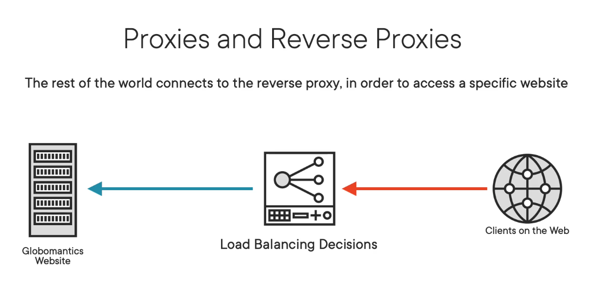

# HTTP headers 

Hypertext Transfer Protocol (HTTP) Field Name Registry
https://www.iana.org/assignments/http-fields/http-fields.xhtml

## Access-Control-*

- Access-Control-Allow-Origin
- Access-Control-Allow-Credentials
- Access-Control-Allow-Headers
- Access-Control-Expose-Headers
- Access-Control-Max-Age
- Access-Control-Request-Headers
- Access-Control-Request-Method
- Access-Control-Allow-Origin
- Access-Control

### Problem description

Cookies are shared even between windows: https://stackoverflow.com/questions/49687204/same-browser-but-different-windows-do-they-share-cookies
This can lead to risky scenario such as
1. User in tab 1 is logged in Youtube.
1. Youtube adds in the response a `Set-Cookie` header with token like value
1. As a consequence webrowser stores the cookies in the cookie jar  
1. User in tab 2 is visiting mywebsite.dev which is `malicious` 
1. Browser of user, is executing javascript in tab 2 from `mywebsite.dev` targeting `youtube.com`
1. Since the Browser see that the desitination is youtube.com for which we have a cookie, it automatically adds the cookies to request
1. Therefore `mywebsite.dev` can perform action on behalf of the user in `youtube.com` 

Note this issue is coming from the fact we execute java script which can perform write operation, when we were using only HTML it was not issue since only READ operation was allowed.
However data could be read and malicpous user could collect this data (send to db in his domain) and make a write operation in a second time. 

### SOP (Same Origin Policy) 

To avoid this scenario, Web browser introduced SOP by default.

Where origin is a 3-uplet (domain, protocol, port)

Eg: Safari on `mywebsite.dev` cannot request something on YouTube.com

In [problem description flow above], browser will block the call made in step 6.


### CORS (Cross Origin Resource Sharing)

CORS headers enables to partially deactivate SOP behavior.

For example CORS allows YouTube to say: you can call me from `mywebsite.dev` (with some headers and cookies).

In [problem description flow above], browser will asks YouTube.com if cross origin is ok (preflight request), and allow or not the call in step 6.


### Note

if reading local file without a web server, CORS is disallowed because:

Message from Firefox

```
Cross-Origin Request Blocked: The Same Origin Policy disallows reading the remote resource at file:///Users/jmazeries/dev/tks_junit5/wwww.google.com. (Reason: CORS request not http).
```

Message from Safari

```
Cross origin requests are only supported for HTTP. 
```

CORS can not be applied to `file://`.

### Alternative to CORS to deal with SOP 

#### Reverse-proxy

##### Flow

Front-End serving mywebsite.dev can proxy request to YouTube directly:


1. Browser request `mywebsite.dev`
2. Html/javascript wants to target `mywebsite.dev/YouTube/video`
3. Browsers allows as same origin (`https, mywebsite.dev, 443`)
4. Browser sends request to `mywebsite.dev/YouTube/video`
5. Proxy send request to `YouTube.com/video`
6. youtube replies to proxy
7. Proxy replies client

##### Consequences
1. this does not send any **user's** cookie to YouTube
2. browser is not aware it interact with youtube

##### Concrete examples

We used reverse proxy solution in: https://github.com/open-denon-heos/remote-control/blob/main/README.md#local-dev-with-apache2-for-heos-api-server-integration

YouTube was `heos python server`
Mywebsite.dev was `localhost:8080/ui`

Apache web server was also acting as a reverse proxy.

Similarly in https://github.com/scoulomb/myhaproxy/blob/main/haproxy/haproxy.cfg


YouTube was `service running on NAS`
Mywebsite.dev was `frontend fe_main`, `https://<WILDCARD>.coulombel.net`

#### Forward proxy

https://en.wikipedia.org/wiki/HTTP_tunnel#HTTP_tunneling_without_using_CONNECT

<!-- atlassian Http+Proxy+for+  ... -->


1. Browser request `mywebsite.dev` (note the FQDN target IP/Port of the proxy, meaning mywebsite.dev is also a forward proxy)
2. Html/javascript wants to target `YouTube.com/video`
3. Html/javascript perform HTTP CONNECT to the proxy
4. Browser sends a `GET youtube.com/video` and send request to the proxy `mywebsite.dev` (which becomes transparent)
5. Proxy relay request to `YouTube.com/video`
5. Proxy relay TCP packet to `YouTube.com/video` (we have 2 TCP connection, right hand side TCP connection is the one opened with the CONNECT)
6. youtube replies to proxy
7. Proxy replies client


## Notes

### Misc

- Nginx, Apache, Caddy are webserver and they can play reverse proxy role. 
HA-proxy is a proxy and does not serve file, except in a hacky way: https://sleeplessbeastie.eu/2020/05/11/how-to-serve-single-file-using-haproxy/)

- A load balancer (F5) is **traditionally** a reverse proxy: https://github.com/scoulomb/myhaproxy/blob/main/haproxy/haproxy.cfg#L44.
Traditionally reverse proxy has a single pool members, but they now allow more. 

- A Forward proxy does not alter destination url: in the case of reverse proxy client does not know the url target by the proxy

- Both reverse proxy and forward proxy open a new socket (socket between client and proxy + socket between proxy and destination)
<!-- reverse proxy keep tcp open -->

### Alternative definition of reverse and forward proxy

@Pluralsight - F5 BIG-IP Fundamentals (ch2) https://app.pluralsight.com/ilx/video-courses/2ffbc823-d42f-4958-9eab-0204e68a2e27/84c9f993-ff85-4734-8ca7-4a927650030a/e490175d-4d5b-4122-8328-84498892b87b

> The F5 is a proxy, more specifically, a reverse proxy, but first let's discuss what a proxy is.


> A proxy acts as a device in the middle of the path between the clients and the servers. 
Clients will first connect to the proxy, and then the proxy will decide whether or not the traffic is allowed to be forwarded to its final destination. 
In the form of a web proxy, the proxy determines if clients can access websites, and those websites are usually not owned by the organization 
that has implemented the proxy. 
So in other words, a proxy is on the outbound perspective, as clients must go through the proxy to access anything. 



> On the other hand, reverse proxies are on the inbound perspective. 
Everything must go through the proxy to access very specific resources. 
So if you are trying to access Globomantics' website and it is located behind a reverse proxy, 
anyone trying to connect to that website must first connect to the reverse proxy,
which will then generate a connection to the backend servers.


> While the F5 is able to act as a proxy for this course, when we are interacting with the F5, it will be in the context of it being a **reverse proxy**. 
But having the two connections terminate on the F5 is what allows the F5 to perform its features.
It's what allows it to decrypt traffic if necessary, inspect that traffic, and make decisions on that traffic, again, decisions like whether or not to even allow the traffic, is there even a server capable of handling the traffic, and everything else we will discuss throughout this course.

This definition is consistent with comment above in [notes](#notes).

Also here they give a definition more based on the use-case of 
- proxy equivalent to [forward proxy](#forward-proxy) above
- reverse-proxy equivalent to [reverse proxy](#reverse-proxy) above

Still we can use a F5 standard virtual server (thus a reverse proxy) for outbound connectivity.
See below section [Link with NAT deep dive].

See link with  private PPT / @PrezNewGen/note on F5 vs type / IP used in outbound with F5 (explicit SNAT) 

### Full proxy vs half proxy 

Quoting https://www.netsys.com.tr/en/what-are-half-proxy-and-full-proxy/ - [saved here](./media/What%20are%20Half%20Proxy%20and%20Full%20Proxy%3F.pdf)
<!-- Safari > File > Export as PDF -->

- In the working logic of **half proxy architecture**, requests from the user are represented by the proxy and the requests are forwarded to the server by the proxy. 
It can be considered how beneficial it is to transfer the request from the user to the server as it is without any action.
=> 1 TCP connection

- A **full proxy** acts as an intermediate device both when sending the request from the user to the server and sending the response from the server to the user.
It provides two separate connection paths, one connection between the user and the proxy, and another connection between the server and the proxy.
Full proxy structure means that the users or servers that the proxy device is connected to do not communicate with each other.
=> 2 TCP connections

Note we can have those 4 combinations: `(reverse, forward) x (full proxy, half proxy)` (forward on full proxy mode may be complex)

Do not confuse with https://my.f5.com/manage/s/article/K65271370 (saved [here](./media/Most Common SSL Methods for LTM: SSL Offload, SSL Pass-Through and Full SSL Proxy.pdf))
- SSL offloading
- SSL Pass through 
- SSL Full Proxy (do not confuse with a full proxy)

Thus we can have in theory the 4 combination X SSL (Offloading, Pass Trough, Full Proxy)
Evidence: [Next section on type of virtual server](#f5-types-of-virtual-server) and https://my.f5.com/manage/s/article/K14343463 - saved [here](./media/Configuring%20the%20BIG-IP%20system%20to%20pass%20through%20SSL%20traffic.pdf)

### F5 types of virtual server

https://my.f5.com/manage/s/article/K7595
https://my.f5.com/manage/s/article/K8082 - Saved [here](./media/Overview%20of%20TCP%20connection%20setup%20for%20BIG-IP%20LTM%20virtual%20server%20types.pdf)

F5 support those kind of virtual servers. 

I will indicate if they are full proxy (re-open a TCP connection, to no confuse with TLS passthough, re-encrypt -- add link here) or half.

- Standard virtual server (reverse proxy, full proxy) 
  - Standard virtual server with a TCP profile
  - Standard virtual server with Layer 7 functionality

- Performance Layer4 virtual server (reverse proxy, half proxy)

- Performance HTTP virtual server (reverse proxy, full proxy)
  - Performance HTTP virtual server with idle server-side flow
  - Performance HTTP virtual server with no idle server-side flow (very close to not say same as standard)
- Forwarding Layer 2 virtual server (forward proxy, half proxy - L2 (switch - commutateur in French)) 
- Forwarding IP virtual server (forward proxy, half proxy)
- Reject virtual server (forward proxy in a way, not half-not full proxy, F5 send `TCP RST`) - Stupid firewall 

A router is layer 3 (IP), all virtual server except Forwarding layer 2 acts at layer 4 level (TCP) (https://fr.wikipedia.org/wiki/Suite_des_protocoles_Internet#/media/Fichier:TCPIP_couche_ISO_modele_OSI.png)

## Link with NAT deep dive

F5 SNAT section: https://github.com/scoulomb/docker-under-the-hood/blob/main/NAT-deep-dive-appendix/README.md#see-also-f5-snat

- https://github.com/scoulomb/docker-under-the-hood/blob/main/NAT-deep-dive-appendix/README.md#section-about-nats
  - Standard virtual server => Kind of DNAT - see [DNAT discussion section just above](#DNAT-discussion)
  - NAT object

- SNAT object: https://github.com/scoulomb/docker-under-the-hood/blob/main/NAT-deep-dive-appendix/README.md#section-about-securenats 
  - Note the part `SNAT pool assigned to virtual server (standard or forwarding IP)`

- Outbound pellicular case https://github.com/scoulomb/docker-under-the-hood/blob/main/NAT-deep-dive-appendix/README.md#pellicular-case-for-outbound
  - Usage with std vs and fw vs <!-- requestor connector vs ip or remote ip directly -->
  - This challenges [alternative-definition-of-reverse-and-forward-proxy](#alternative-definition-of-reverse-and-forward-proxy)

See link with  private PPT / @PrezNewGen/note on F5 vs type 

ISP bpx and NAT box does pure natting

## DNAT discussion 

We say Load Balancer is a “kind of DNAT” @https://github.com/scoulomb/docker-under-the-hood/blob/main/NAT-deep-dive-appendix/README.md#section-about-nats 
But this is partially true.

DNAT is layer 3. We keep same socket and we alter the IP packet destination header
Load balancer kind of DNAT as it is in layer 4. Load balancer operates at TCP level (in full proxy or half proxy mode) unlike pure natting (except Forwarding Layer 2 virtual server)
(Load balancer/reverse proxy can also send to several destination, where a pure NAT is simple mapping. for example  `(wan ip, wan port, wan proto)` to `(internal IP, internal ports, internal proto)`
<!-- I put WAN but WAN can be a LAN -->

It also applies here: https://github.com/scoulomb/docker-under-the-hood/blob/main/NAT-deep-dive-appendix/README.md#pellicular-case-for-outbound

<!-- doc is ccl until here --> 
<!-- Updated cross link in nat-deep-dive-appendix => DONE, above clear OK: https://github.com/scoulomb/docker-under-the-hood/commit/5371e833674dcdecef2cb8fda238e1acf662703b -->
<!-- re-concluded 22 nov 24 OK via new updates OK-->